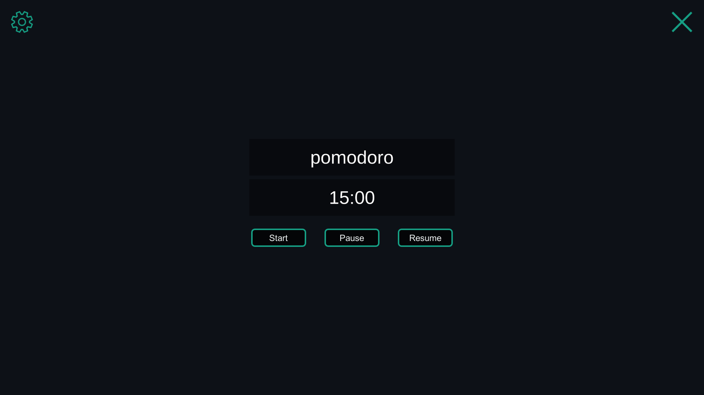
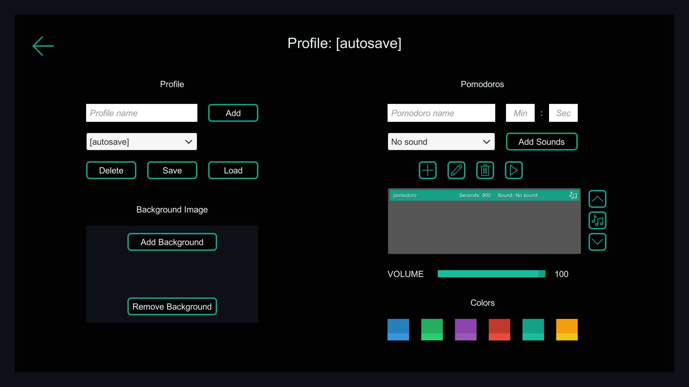

# Pomodoro App
A customizable Pomodoro application

## Instructions

### Main screen

* click the gear icon to open the [settings](#settings)
* click the "×" icon to close the application
* click the "Start" button to start the countdown. Press start again to reset the countdown
* click the "Pause" button to stop the countdown
* click the "Resume" button to resume the countdown

### Settings

* click the back icon to close the settings and go back to the [main screen](#main-screen)

#### Profiles
* enter a name and then click "Add" to add a new profile
* use the dopdown to select a profile
* press "Delete"/"Save"/"Load" to delete/save/load the currently selected profile

#### Background Image
* click the "Add Background" button to add a background image to the application
* click the "Remove Background" button to remove the currently set background image

#### Pomodoros
* input a name, minute and second duration for a pomodoro
* click "Add Sounds" to import external sounds
* use the dropdown to select the desired sound

* use the four buttons to create a new pomodoro, edit the currently selected pomodoro, delete the selected pomodoro or play the currently selected sound

* use the up and down arrows to move the selected pomodoro up or down
* use the music icon to set the currently playing pomodoro (the pomodoro from which the countdown will start on the main screen)

#### Other
* use the volume slider to set the desired volume for the current profile

* click on one of the colors to change the profile colors

### Tips
* the "[autosave]" profile saves the current settings when closing the application. You can load it in case you forgot to save the changes to your profile
* you can press ESC to open and close the settings menu
